# UART Diagnostic Data Flow

## Runtime Flow

```mermaid
flowchart LR
    MPU["MPU6050<br/>I2C1"] -->|"20Hz Burst Read"| Driver["mpu6050.c<br/>Raw + Complementary Filter"]
    Driver --> Sample["IMU_Sample_t<br/>Transport-independent Data"]
    Sample -->|"10Hz"| Telemetry["telemetry.c<br/>CSV Serializer"]
    Telemetry -->|"USART1 TX"| Terminal["Mac UART Terminal<br/>Log and Evidence"]

    Terminal -->|"USART1 RX, 1byte"| ISR["RX ISR<br/>Enqueue + Re-arm only"]
    ISR --> Ring["64byte Ring Buffer"]
    Ring --> Parser["main context<br/>Line Parser"]
    Parser --> Command["status / stream on / stream off"]
    Command --> State["System State"]
    State --> Telemetry
```

## Scheduling

| Task | Period | Context | Responsibility |
|---|---:|---|---|
| UART RX | Event-driven | ISR | Byte Enqueue, RX 재무장전 |
| UART Parser | Every main loop | main | Dequeue, Line 조립, Command 판별 |
| Sensor Sampling | 50ms, 20Hz | main | I2C Burst Read, 자세각과 Filter 갱신 |
| Telemetry Publish | 100ms, 10Hz | main | `IMU_Sample_t` CSV 직렬화와 TX |
| Reconnect Probe | 1000ms, Offline only | main | WHO_AM_I 재확인과 Sensor 재초기화 |

## Design Boundaries

- ISR에서는 `printf`, `HAL_Delay`, 문자열 비교, Sensor 접근을 수행하지 않는다.
- RX Producer와 main Consumer의 속도를 분리하기 위해 고정 크기 Ring Buffer를 사용한다.
- Sensor 처리와 Transport를 `IMU_Sample_t`로 분리해 후속 CAN Frame Packing에서도 같은 Data Model을 재사용한다.
- Sensor Offline 전이 시 Error를 한 번 기록하고, 복구 전까지 오래된 자세각을 정상 Telemetry로 발행하지 않는다.
